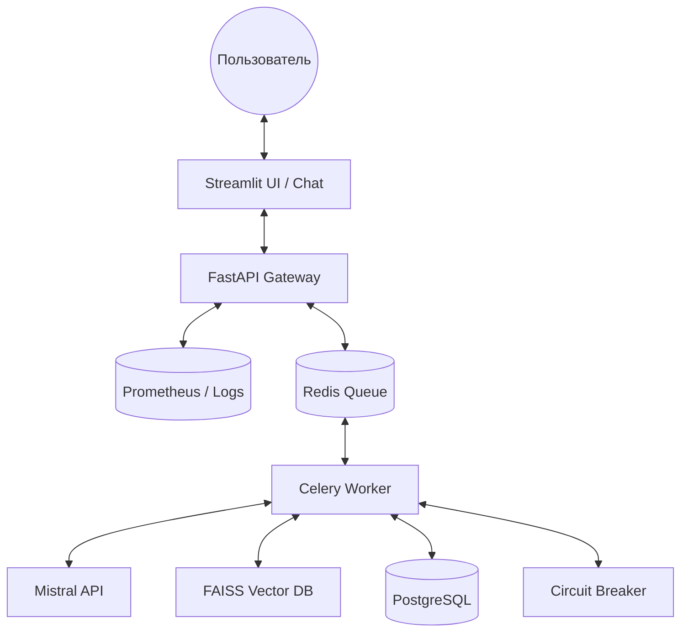
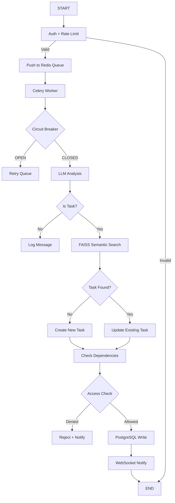

# TaskPilot — Автономный ассистент управления задачами.

**TaskPilot Agent** — это агентная система управления задачами с автономной обработкой входящих сообщений, семантическим поиском и строгим контролем доступа. Система преобразует хаотичные сообщения (чат, почта, голос) в структурированные задачи, автоматически фиксируя проблемы и зависимости между ними.

---

## Проблема

Руководители и специалисты тонут в переписке: задачи теряются в чатах, зависимости забываются, а история проблем не накапливается. Существующие трекеры требуют ручного ввода, что снижает актуальность данных и приводит к тому, что бэклог устарает быстрее, чем обновляется.

**Глубинная проблема:** Люди вручную переносят задачи из писем и сообщений в трекеры, вручную отслеживают зависимости и не накапливают знания о том, какие проблемы возникали и как их решали.

---

## Что делает агент

### 1. Классификация сообщений
LLM анализирует входящее сообщение и определяет:
- **Является ли задачей** (есть действие, дедлайн, результат)
- **Уверенность классификации** (0.0–1.0)
- **Необходимость уточнения** (если неоднозначно)

### 2. Извлечение сущностей
Автоматическое извлечение из текста:
- **Заголовок задачи** — краткая формулировка
- **Описание** — детали и контекст
- **Дедлайн** — парсинг дат из текста («до пятницы» → ISO 8601)
- **Приоритет** — шкала 1–10
- **Проблема/препятствие** — «жду данные от Иванова», «срыв из-за смежников»
- **Зависимости** — ссылки на другие задачи

### 3. Семантический поиск (FAISS)
- **Векторизация запроса** → embedding модель `BAAI/bge-small-en-v1.5` (384d)
- **Поиск кандидатов** → top-5 по косинусному сходству
- **LLM reranking** → выбор наиболее релевантной задачи
- **Threshold check** → если сходство < 0.75 → запрос уточнения

### 4. Создание/обновление задач
- **Новая задача** → запись в PostgreSQL с цитированием источника
- **Обновление существующей** → изменение статуса, дедлайна, проблемы
- **Журнал зависимостей** → фиксация связей между задачами

### 5. Контроль доступа (RLS)
- **PostgreSQL Row-Level Security** → изоляция на уровне БД
- **group_id фильтрация** → пользователи видят только задачи своей группы
- **JWT-аутентификация** → токены с TTL 30 мин

### 6. Асинхронная обработка (Celery)
- **Очередь Redis** → буферизация запросов
- **Фоновые воркеры** → обработка без блокировки UI
- **Retry-логика** → до 3 попыток при сбоях
- **Timeout 35 сек** → защита от зависаний

---

## Архитектура



### Компоненты системы

| Модуль | Технология | Обязанности |
| :--- | :--- | :--- |
| **UI** | Streamlit | Чат-интерфейс, бэклог задач, уведомления, auth |
| **Gateway** | FastAPI | Auth, rate limiting, валидация, push в очередь |
| **Worker** | Celery | Асинхронная обработка, вызов LLM, запись в БД |
| **Agent Core** | Python + Mistral LLM | Анализ сообщений, извлечение сущностей, классификация |
| **Retriever** | FAISS | Семантический поиск задач по эмбеддингам (384d) |
| **Task Manager** | PostgreSQL + RLS | CRUD задач, журнал зависимостей, изоляция данных |
| **Observability** | Prometheus + JSON Logs | Метрики, логи, трейсы, health checks |

---

## Стек технологий

| Категория | Технологии |
| :--- | :--- |
| **Язык** | Python 3.10+ |
| **Web Framework** | FastAPI, Streamlit |
| **Message Queue** | Redis + Celery |
| **Database** | PostgreSQL (RLS), SQLAlchemy 2.0 (async) |
| **Vector Search** | FAISS (in-memory + persistence) |
| **Embedding Model** | `BAAI/bge-small-en-v1.5` (384 dimensions) |
| **LLM** | Mistral API (`mistral-small-latest`) |
| **Auth** | JWT (HS256, 30 мин TTL) |
| **Monitoring** | Prometheus, OpenTelemetry, structlog |
| **Infrastructure** | Docker Compose, Circuit Breaker pattern |

---

## System Design Decisions (ADR)

| ID | Решение | Обоснование | Статус |
| :--- | :--- | :--- | :--- |
| **ADR-001** | Celery + Redis для асинхронной обработки | Изоляция UI от обработки, retry-логика, горизонтальное масштабирование воркеров | ✅ Реализовано |
| **ADR-002** | PostgreSQL RLS для изоляции данных | Гарантия, что пользователи не видят задачи других групп на уровне БД | ✅ Реализовано |
| **ADR-003** | FAISS для семантического поиска задач | Точное связывание сообщений с существующими задачами даже при неточных названиях | ✅ Реализовано |
| **ADR-004** | Repository Pattern для Task Manager | Возможность замены бэкенда (PostgreSQL → Vikunja/Jira) без изменения агента | ✅ Реализовано |
| **ADR-005** | Circuit Breaker для LLM API | Защита от каскадных сбоев при недоступности Mistral API | ✅ Реализовано |
| **ADR-006** | Structured Logging + Prometheus | Полная наблюдаемость: трейсы, метрики, алерты для инфраструктурного трека | ✅ Реализовано |

---

## Поток выполнения (Workflow)



### UnifiedState для передачи данных между узлами

```python
class UnifiedState(TypedDict):
    user_id: str                    # ID пользователя
    group_id: str                   # ID группы
    message_text: str               # Исходное сообщение
    trace_id: str                   # ID для трейсинга
    is_task: bool                   # Результат классификации
    extracted_entities: Dict        # Заголовок, дедлайн, проблема
    candidate_tasks: List[Dict]     # Результаты поиска в FAISS
    matched_task_id: Optional[str]  # ID найденной задачи
    action: str                     # create / update / summary
    final_response: str             # Ответ пользователю
    turn_count: int                 # Счётчик итераций (для уточнений)
```

---

## Модель данных (PostgreSQL)

### Таблицы

| Таблица | Назначение | Ключевые поля |
| :--- | :--- | :--- |
| **groups** | Группы/отделы пользователей | `id`, `name`, `description` |
| **users** | Пользователи системы | `id`, `username`, `email`, `password_hash`, `group_id` |
| **tasks** | Задачи (основная сущность) | `id`, `user_id`, `group_id`, `title`, `status`, `priority`, `deadline`, `problem`, `dependencies` |
| **dependencies** | Журнал зависимостей между задачами | `task_id`, `depends_on_id`, `status`, `resolved_at` |
| **messages** | История чата | `id`, `user_id`, `group_id`, `content`, `role` |
| **audit_log** | Журнал аудита действий | `user_id`, `action`, `resource_type`, `details`, `ip_address` |

### Row-Level Security (RLS)

Все запросы к таблицам `tasks`, `messages`, `dependencies` фильтруются по `group_id` и `user_id` на уровне БД:

```sql
-- Пример политики RLS
CREATE POLICY tasks_group_isolation ON tasks
    USING (group_id = current_setting('app.current_group_id')::uuid);
```

---

## Архитектура поиска (Retrieval)

### Структура индексов FAISS

| Коллекция | Назначение | Размерность |
| :--- | :--- | :---: |
| `task_titles` | Поиск по названиям задач | 384 (bge-small) |
| `task_descriptions` | Поиск по описаниям и проблемам | 384 |
| `chat_history` | Контекст диалога для агента | 384 |

### Стратегия поиска

1. **Векторизация запроса** → использование embedding модели `BAAI/bge-small-en-v1.5`.
2. **Фильтрация по `group_id`** → изоляция данных на уровне поиска.
3. **Top-K retrieval** → получение 5 кандидатов по косинусному сходству.
4. **LLM reranking** → выбор наиболее релевантной задачи из кандидатов.
5. **Threshold check** → если сходство < `0.75` → запрос уточнения у пользователя.

---

## Управление состоянием

| Компонент | Хранилище | TTL |
| :--- | :--- | :--- |
| `JWT Token` | Redis | 30 мин |
| `Chat History` | PostgreSQL | 90 дней |
| `Active Tasks` | PostgreSQL | Бессрочно |
| `Circuit Breaker` | Redis | 60 сек |
| `Rate Limit Counter` | Redis | 1 мин (скользящее окно) |

---

## Observability & Metrics

### Prometheus метрики

#### Производительность
```prometheus
taskpilot_agent_latency_seconds{quantile="0.5|0.95|0.99"}
taskpilot_llm_api_latency_seconds{model, status}
taskpilot_queue_size{queue_name}
taskpilot_faiss_search_latency_seconds
```

#### Надёжность
```prometheus
taskpilot_llm_api_errors_total{error_type="timeout|5xx|invalid"}
taskpilot_circuit_breaker_state{service="llm|db|redis"}
taskpilot_health_check_status{component}
taskpilot_retry_count_total{task_name}
```

#### Ресурсы
```prometheus
taskpilot_db_pool_connections{state="active|idle"}
taskpilot_worker_processes{hostname}
taskpilot_memory_used_bytes{component}
taskpilot_system_cpu_percent
taskpilot_system_memory_percent
```

### LLM-метрики (TTFT/TPOT/Cost)

- **TTFT (Time to First Token)** — время до первого токена
- **TPOT (Time per Output Token)** — среднее время генерации токена
- **Token Count** — входные/выходные токены
- **Cost Tracking** — стоимость запроса в USD (по прайсам Mistral)

---

## Circuit Breaker

### Состояния

| Состояние | Описание | Поведение |
| :--- | :--- | :--- |
| **CLOSED** | Нормальная работа | Запросы проходят |
| **OPEN** | Сбой, запросы блокируются | Возврат ошибки, таймер обратного отсчёта |
| **HALF_OPEN** | Тестовый режим | Один тестовый запрос для проверки восстановления |

### Конфигурация

```python
CircuitBreakerConfig(
    failure_threshold=5,      # Количество ошибок для открытия
    recovery_timeout=60,      # Время до попытки восстановления (сек)
    half_open_max_calls=1,    # Количество тестовых запросов в HALF_OPEN
    timeout_window=300        # Окно времени для подсчёта ошибок (сек)
)
```

### Global Instances

- `llm_circuit_breaker` — защита Mistral API
- `postgres_circuit_breaker` — защита БД
- `redis_circuit_breaker` — защита Redis
- `faiss_circuit_breaker` — защита векторного поиска

---

## Безопасность и Governance

### Risk Register

| Риск | Вероятность / Влияние | Детект | Защита | Остаточный риск |
| :--- | :--- | :--- | :--- | :--- |
| **Утечка данных между пользователями** | Низкая / Очень высокое | Аудит логов доступа, тесты на проникновение | RLS в PostgreSQL, проверка `user_id` в коде перед каждым запросом к БД/FAISS | Низкий |
| **Галлюцинация ID задачи** | Средняя / Высокое | Валидация существования ID перед записью | LLM возвращает название → Код ищет ID через векторный поиск → Подтверждение пользователем при неуверенности | Низкий |
| **Устаревание векторного индекса** | Средняя / Среднее | Мониторинг рассинхронизации PG ↔ FAISS | Синхронное обновление индекса при транзакции записи в PG | Низкий |
| **Некорректное разрешение зависимостей** | Средняя / Среднее | Логирование изменений в журнале зависимостей | Агент предупреждает о циклических зависимостях, требует подтверждения критических изменений | Средний |
| **Инъекции в промпт / SQL** | Низкая / Высокое | Валидация входных данных, параметризованные запросы | Экранирование ввода, использование ORM, разделение контекста и инструкций для LLM | Низкий |

### Политика логов и работы с данными

- **Персональные данные:** В логах `user_id` хешируется, тексты сообщений обезличиваются (удаление телефонов, emails) перед записью в audit log.
- **Векторная база:** Хранит только эмбеддинги описаний задач, без привязки к личным данным напрямую (связь через ID в PG).
- **Хранение:** Задачи хранятся бессрочно, история изменений (audit) — 1 год, логи сессий — 30 дней.
- **Доступ:** Принцип наименьших привилегий. Агент действует от имени пользователя, не имеет прав суперпользователя на данные других групп.

### Защита от инъекций и подтверждение действий

- **Валидация ввода:** Все текстовые поля перед передачей в LLM и SQL проходят санитизацию.
- **Подтверждение изменений:** При изменении статуса на "Выполнено" или удалении задачи, если уверенность агента <90%, требуется явное подтверждение пользователя.
- **Изоляция контекста:** При поиске в FAISS запрос обогащается фильтром по `group_id`/`user_id`, чтобы векторный поиск не возвращал задачи из других проектов/отделов.
- **Обратная связь:** В ответе агента всегда указываются ID затронутых задач для прозрачности действий.

---

## Ограничения

| Тип | Ограничение |
| :--- | :--- |
| **Технические** | Лимит контекста 2000 токенов на запрос; FAISS in-memory (до 1k задач); p95 latency <10 сек |
| **Бюджет** | Лимит $10/мес на Mistral API |
| **Вне скоупа (MVP)** | Потоковая передача, реальная почта (IMAP), аудио-транскрибация, интеграция с Jira/Trello |
| **Язык (MVP)** | Только русский |
| **Пользователи (MVP)** | До 15 concurrent |

---

## Быстрый старт

### 1. Клонировать
```bash
git clone https://github.com/taskpilot-agent.git 
cd taskpilot-agent
```

### 2. Настроить
```bash
cp .env.example .env
# Заполнить MISTRAL_API_KEY, JWT_SECRET, DATABASE_URL
```

### 3. Запустить (Docker Compose)
```bash
docker compose up -d
# postgres + redis + api + worker + streamlit
```

### 4. Проверить здоровье
```bash
curl http://localhost:8000/health/ready
# {"status": "healthy", "components": {"database": true, "llm_circuit_breaker": "closed"}}
```

### 5. Открыть UI
```
http://localhost:8501
```

---

## Структура проекта

```
src/
  app/
    main.py              # FastAPI entrypoint, middleware, routes
    config.py            # Pydantic settings (DB, Redis, LLM, FAISS)
    
    api/
      auth.py            # JWT authentication router
      health.py          # Health check endpoints
    
    worker/
      celery_app.py      # Celery configuration
      tasks.py           # Celery tasks (process_message, get_task_summary)
      agent.py           # LLM agent core (classify, extract, respond)
      agent_v0.py        # Legacy agent version
      agent_v1.py        # Next-gen agent with graph workflow
    
    db/
      models.py          # SQLAlchemy ORM (6 tables, RLS policies)
      engine.py          # DB connection pool, session factory, RLS context
      task_repository.py # Repository pattern for task operations
    
    search/
      faiss_index.py     # FAISS index manager (add, search, persist)
    
    infrastructure/
      circuit_breaker.py # Circuit Breaker pattern (Redis-backed state)
      metrics.py         # Prometheus metrics + OpenTelemetry
      rate_limiter.py    # Rate limiting (slowapi)
    
    ui/
      streamlit_app.py   # Chat UI, task backlog, auth flow

docs/
  product-proposal.md    # Обоснование, метрики, сценарии
  system-design.md       # Архитектура, workflow, ADR
  governance.md          # Риски, PII, injection protection
```

---

## API Endpoints

| Endpoint | Method | Описание |
| :--- | :--- | :--- |
| `/` | GET | Root endpoint (version, status) |
| `/health/ready` | GET | Deep health check (DB, Circuit Breaker) |
| `/metrics` | GET | Prometheus metrics endpoint |
| `/auth/login` | POST | JWT login (username/password) |
| `/auth/refresh` | POST | Refresh access token |
| `/auth/me` | GET | Current user info |
| `/chat` | POST | Send message to agent (rate limited: 60/min) |
| `/tasks` | GET | Get user tasks (rate limited: 100/min) |

---

## Сценарии использования

### Основной сценарий
**Пользователь:** «Нужно подготовить отчет до пятницы, жду данные от Иванова»

**Агент:**
1. Классифицирует как задачу (confidence: 0.94)
2. Извлекает сущности:
   - Title: «Подготовить отчет»
   - Deadline: 2024-XX-XX (пятница)
   - Problem: «ожидание данных от Иванова»
3. Создаёт задачу в PostgreSQL
4. Возвращает ответ: «✅ Создал задачу #abc123: Подготовить отчет (дедлайн: пятница). Зафиксировал проблему: ожидание данных от Иванова.»

### Обновление задачи
**Пользователь:** «По отчету данные пришли»

**Агент:**
1. Семантический поиск в FAISS → находит задачу «Подготовить отчет»
2. Обновляет поле `problem` → NULL
3. Меняет статус → «В работе»
4. Ответ: «📝 Обновил задачу #abc123: проблема решена, статус изменён на «В работе».»

### Зависимости
**Пользователь:** «Задача Б не начнется пока не закроется Задача А»

**Агент:**
1. Находит обе задачи через FAISS
2. Создаёт запись в таблице `dependencies`
3. Ответ: «🔗 Добавил зависимость: Задача Б зависит от Задачи А.»

### Саммари
**Пользователь:** «Покажи статус по отчету и что его стопорит»

**Агент:**
1. Поиск задачи по названию
2. Формирование сводки из карточки + журнал зависимостей
3. Ответ: «📊 Задача #abc123: статус «В работе», дедлайн пятница. Зависимости: нет. Проблемы: нет.»

### Edge-кейсы

| Ситуация | Реакция агента |
| :--- | :--- |
| **Неоднозначная ссылка** («Обнови ту задачу по маркетингу») | «Вы имеете в виду задачу X или Y?» |
| **Нет доступа** (запрос задачи другой группы) | «У вас нет доступа к этой задаче» |
| **Противоречие** (статус «Готово», но активные зависимости) | «⚠️ Обнаружен конфликт: задача имеет активные зависимости. Подтвердите завершение.» |
| **LLM недоступен** (Circuit Breaker OPEN) | «Сервис временно перегружен. Попробуйте через минуту.» |

---

## За рамками PoC

- **Интеграция с реальными трекерами** (Jira, Trello, Asana)
- **Постоянный мониторинг почты** (IMAP/SMTP integration)
- **Аудио-транскрибация** (Whisper для голосовых заметок)
- **Мультиязычность** (поддержка EN/RU/KZ)
- **Графовые зависимости** (циклические связи, критический путь)
- **Обучение на поведении пользователя** (fine-tuning под стиль команды)
- **Интеграция с календарями** (Google Calendar, Outlook)
- **Уведомления в мессенджеры** (Telegram, Slack)

---

## Метрики успеха

### Продуктовые
- Точность связывания сообщений с существующими задачами **>85%** (через семантический поиск)
- Доля задач с автоматически заполненным полем «проблема» **>50%**

### Агентские
- Точность извлечения сущностей (дедлайн, статус, зависимость) **>90%**
- Способность корректно запросить уточнение при неоднозначности **100%** случаев сомнений

### Технические
- Время ответа на запрос (p95) **<5 сек** (без учета LLM latency)
- Строгость изоляции данных **0 утечек** между пользователями
- Доступность PostgreSQL и Vector DB **>99%**
- Актуальность векторного индекса (задержка PG ↔ FAISS) **<1 мин**

---

## Документация
  - [Product Proposal](docs/product-proposal.md) — обоснование, метрики, сценарии
  - [System Design](docs/system-design.md) — архитектура, workflow, ADR
  - [Governance](docs/governance.md) — риски, PII, injection protection
  - [C4 Context](docs/diagrams/c4-context.md) — система и внешние сервисы
  - [C4 Container](docs/diagrams/c4-container.md) — контейнеры и технологии
  - [C4 Component](docs/diagrams/c4-component.md) — внутреннее устройство
  - [Workflow](docs/diagrams/workflow.md) — поток выполнения с ветками ошибок
  - [Data Flow](docs/diagrams/data-flow.md) — движение данных через систему
  - [Retriever Spec](docs/specs/retriever.md) — спецификация поиска
  - [Agent Spec](docs/specs/agent-orchestrator.md) — спецификация агента
  - [Tools/APIs Spec](docs/specs/tools-apis.md) — контракты интеграций
  - [Observability Spec](docs/specs/observability-evals.md) — метрики, логи, алерты
- **API Docs:** `http://localhost:8000/docs` (Swagger UI)
