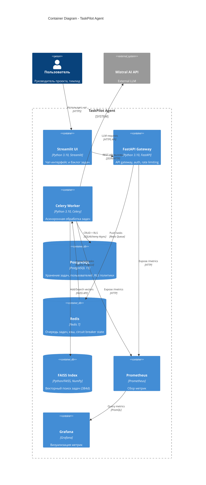

# C4 Container Diagram: TaskPilot Agent

## Overview
Container diagram showing the high-level technology choices and how containers communicate.

## Container Specifications

| Container | Technology | Responsibilities | Ports |
|-----------|------------|------------------|-------|
| **Streamlit UI** | Python 3.10, Streamlit | Чат-интерфейс, отображение бэклога, JWT auth flow | :8501 |
| **FastAPI Gateway** | Python 3.10, FastAPI | Auth, rate limiting, validation, push to queue, health checks | :8000 |
| **Celery Worker** | Python 3.10, Celery | Async message processing, LLM calls, DB writes, FAISS sync | N/A |
| **PostgreSQL** | PostgreSQL 15 | Task storage, user management, RLS policies, audit log | :5432 |
| **Redis** | Redis 7 | Task queue, caching, circuit breaker state, rate limiting | :6379 |
| **FAISS Index** | Python/FAISS, NumPy | Semantic search, vector embeddings (384d), persistence to disk | In-Memory |
| **Prometheus** | Prometheus | Metrics collection, alerting rules, time-series storage | :9090 |
| **Grafana** | Grafana | Dashboards, visualization, alerts | :3000 |

## Communication Protocols

| Connection | Protocol | Data Format | Security |
|------------|----------|-------------|----------|
| User ↔ UI | HTTPS | JSON | JWT |
| UI ↔ API | HTTP | JSON | CORS |
| API ↔ Redis | Redis Protocol | Pickle/JSON | Network isolation |
| Worker ↔ PostgreSQL | PostgreSQL Wire | SQL (SQLAlchemy ORM) | RLS, credentials |
| Worker ↔ Mistral | HTTPS | JSON | API Key |
| Prometheus ↔ Containers | HTTP | Prometheus Text | Network isolation |
