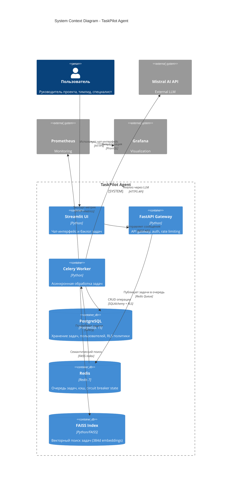

# C4 Context Diagram: TaskPilot Agent

## Overview
System context diagram showing TaskPilot Agent and its relationships with users and external systems.

## Boundaries

| Boundary | Description |
|----------|-------------|
| **TaskPilot Agent** | Основная система управления задачами с агентной обработкой |
| **User** | Внешний пользователь (руководитель, тимлид, специалист) |
| **Mistral AI API** | Внешний LLM-сервис для анализа и генерации текста |
| **Prometheus/Grafana** | Система мониторинга и визуализации |

## Trust Boundaries

- **User ↔ UI**: HTTPS, JWT-аутентификация
- **UI ↔ API**: Внутренняя сеть Docker, CORS policies
- **API ↔ Worker**: Redis queue, изоляция через сеть
- **Worker ↔ LLM**: HTTPS с API key authentication
- **Worker ↔ DB**: PostgreSQL RLS для изоляции данных
