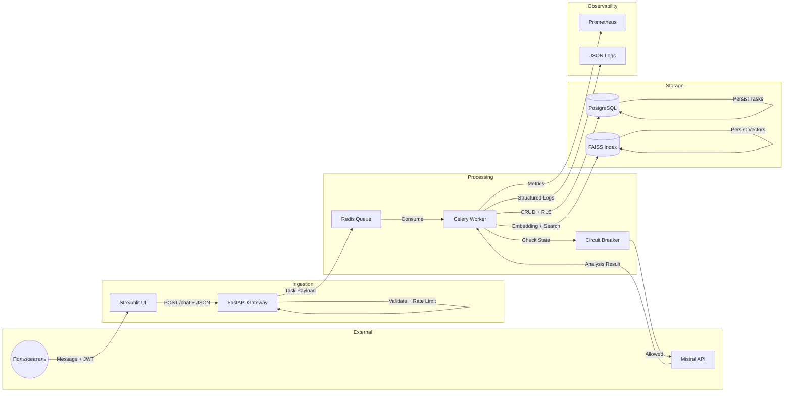

# Data Flow Diagram: TaskPilot Agent

## Overview
Data flow diagram showing how data moves through the system, what is stored, and what is logged.



## Data Stores

| Store | Type | Data Stored | Retention | Encryption |
|-------|------|-------------|-----------|------------|
| **PostgreSQL** | Relational DB | Users, tasks, messages, dependencies, audit_log | Tasks: indefinite, Messages: 90 days, Audit: 1 year | At-rest (disk), In-transit (TLS) |
| **Redis** | In-Memory Cache | Queue tasks, JWT sessions, rate limit counters, circuit breaker state | TTL-based (30min - 24h) | In-transit (optional TLS) |
| **FAISS Index** | Vector Index | Task embeddings (384d), ID mappings | Indefinite (sync with PG) | None (in-memory + disk persistence) |
| **JSON Logs** | File Storage | Structured logs with trace IDs, user actions | 30 days | None (file system permissions) |
| **Prometheus** | Time-Series DB | Metrics (latency, errors, throughput, resource usage) | Based on retention config | None (internal network) |

## Data Flow Paths

### 1. Message Ingestion Flow
```
User → UI → API → Redis Queue
```
- **Data**: Message text, user_id, group_id, JWT token
- **Format**: JSON
- **Validation**: Pydantic models, JWT decode, rate limit check

### 2. Processing Flow
```
Redis Queue → Celery Worker → Circuit Breaker → Mistral API → Worker
```
- **Data**: Serialized task payload, LLM prompts, API responses
- **Format**: Pickle (Celery), JSON (LLM API)
- **Protection**: Circuit breaker, retry logic, timeout handling

### 3. Retrieval Flow
```
Worker → FAISS → Embedding Model → Top-K Results → LLM Reranking
```
- **Data**: Query text, embeddings (384d vectors), task IDs, similarity scores
- **Format**: NumPy arrays, Python dicts
- **Filtering**: group_id isolation at search time

### 4. Persistence Flow
```
Worker → PostgreSQL (RLS) → Transaction Commit → FAISS Sync
```
- **Data**: Task records, message history, dependency journals, audit entries
- **Format**: SQLAlchemy ORM → SQL
- **Isolation**: RLS policies, transactional writes

### 5. Observability Flow
```
Worker/API → Prometheus Metrics + JSON Logs → Grafana Dashboards
```
- **Data**: Latency histograms, error counters, circuit breaker states, CPU/memory gauges
- **Format**: Prometheus text format, structured JSON logs
- **Alerts**: Threshold-based rules in Prometheus Alertmanager

## Data Classification

| Data Type | Sensitivity | Storage Location | Access Control |
|-----------|-------------|------------------|----------------|
| **JWT Tokens** | High | Redis (cache) | TTL 30min, per-user |
| **User Credentials** | Critical | PostgreSQL (password_hash) | bcrypt hash, never logged |
| **Task Content** | Medium | PostgreSQL, FAISS | RLS by group_id |
| **Chat History** | Medium | PostgreSQL | RLS by group_id |
| **Audit Logs** | High | PostgreSQL | Admin only |
| **Metrics** | Low | Prometheus | Internal network |
| **Embeddings** | Low | FAISS (disk) | group_id filtered |

## Logging Policy

### What Is Logged
- ✅ Request timestamps, endpoints, status codes
- ✅ Trace IDs for correlation
- ✅ Circuit breaker state transitions
- ✅ LLM token counts (input/output), latency, cost
- ✅ Task creation/update/delete actions (audit_log)
- ✅ Error messages (sanitized)

### What Is NOT Logged
- ❌ Raw message content (only in chat history table)
- ❌ User passwords or tokens
- ❌ Full LLM prompts/responses (only metadata)
- ❌ PII (phone numbers, emails are hashed/removed)

### Log Format Example
```json
{
  "timestamp": "2024-01-15T10:30:00Z",
  "level": "info",
  "event": "task_created",
  "trace_id": "abc123-def456",
  "user_id": "hashed_uuid",
  "task_id": "uuid",
  "task_title": "Подготовить отчет",
  "latency_ms": 2345,
  "llm_model": "mistral-small-latest",
  "input_tokens": 150,
  "output_tokens": 80,
  "cost_usd": 0.000123
}
```

## Data Retention Schedule

| Data Type | Retention Period | Cleanup Method |
|-----------|------------------|----------------|
| Active Tasks | Indefinite | Manual archive/delete |
| Completed Tasks | Indefinite | Optional archive after 1 year |
| Chat Messages | 90 days | Automated cron job |
| Audit Logs | 1 year | Automated purge |
| Metrics (Prometheus) | 15 days (default) | TSDB retention |
| JSON Logs | 30 days | Log rotation + deletion |
| Redis Keys | TTL-based | Automatic expiration |
| FAISS Vectors | Indefinite | Sync with PG deletions |
