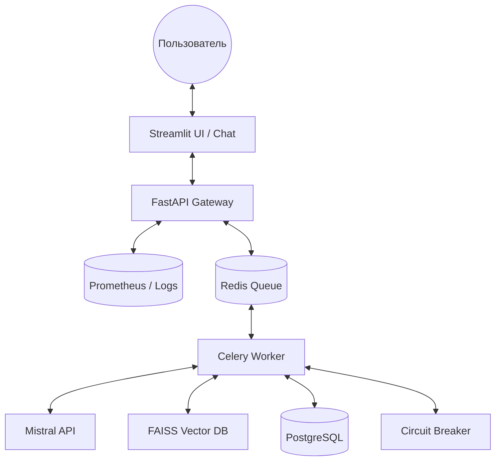
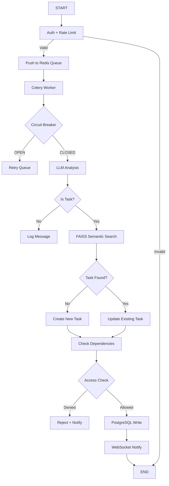

# System Design: TaskPilot Agent

## 1. Обзор системы

**TaskPilot Agent** — это автономная система управления задачами с агентной обработкой входящих сообщений, семантическим поиском и строгим контролем доступа. Система построена на базе Celery для асинхронной обработки, PostgreSQL для надёжного хранения и FAISS для семантического поиска задач.

### Ключевые показатели

| Тип | Показатель |
| :--- | :--- |
| **Функциональные** | Создание/обновление задач из сообщений с цитированием источника |
| **Производительность** | p95 latency < 10 сек (без учёта LLM), обработка очереди < 60 сек |
| **Инфраструктура** | PostgreSQL (RLS), FAISS (Vector DB), Prometheus (Observability) |
| **Безопасность** | Изоляция пользователей на уровне БД + кода, JWT-аутентификация |

---

## 2. Архитектурные решения (ADR)

| ID | Решение | Обоснование | Статус |
| :--- | :--- | :--- | :--- |
| **ADR-001** | Celery + Redis для асинхронной обработки | Изоляция UI от обработки, retry-логика, горизонтальное масштабирование воркеров | ✅ Реализовано |
| **ADR-002** | PostgreSQL RLS для изоляции данных | Гарантия, что пользователи не видят задачи других групп на уровне БД | ✅ Реализовано |
| **ADR-003** | FAISS для семантического поиска задач | Точное связывание сообщений с существующими задачами даже при неточных названиях | ✅ Реализовано |
| **ADR-004** | Repository Pattern для Task Manager | Возможность замены бэкенда (PostgreSQL → Vikunja/Jira) без изменения агента | ✅ Реализовано |
| **ADR-005** | Circuit Breaker для LLM API | Защита от каскадных сбоев при недоступности Mistral API | ✅ Реализовано |
| **ADR-006** | Structured Logging + Prometheus | Полная наблюдаемость: трейсы, метрики, алерты для инфраструктурного трека | ✅ Реализовано |

---

## 3. Архитектура системы

### Компоненты системы


### Обязанности модулей

| Модуль | Технология | Обязанности |
| :--- | :--- | :--- |
| **UI** | Streamlit | Чат-интерфейс, бэклог задач, уведомления |
| **Gateway** | FastAPI | Auth, rate limiting, валидация, push в очередь |
| **Worker** | Celery | Асинхронная обработка, вызов LLM, запись в БД |
| **Agent Core** | Python + LLM | Анализ сообщений, извлечение сущностей, классификация |
| **Retriever** | FAISS | Семантический поиск задач по эмбеддингам |
| **Task Manager** | PostgreSQL | CRUD задач, журнал зависимостей, RLS |
| **Observability** | Prometheus + JSON Logs | Метрики, логи, трейсы, health checks |

## 4. Поток выполнения (Workflow)

### Структура графа выполнения

## 5. Управление состоянием

## UnifiedState для передачи данных между узлами
```python
class UnifiedState(TypedDict):
    user_id: str                    # ID пользователя
    group_id: str                   # ID группы
    message_text: str               # Исходное сообщение
    trace_id: str                   # ID для трейсинга
    is_task: bool                   # Результат классификации
    extracted_entities: Dict        # Заголовок, дедлайн, проблема
    candidate_tasks: List[Dict]     # Результаты поиска в FAISS
    matched_task_id: Optional[str]  # ID найденной задачи
    action: str                     # create / update / summary
    final_response: str             # Ответ пользователю
    turn_count: int                 # Счётчик итераций (для уточнений)
```
## Session State

| Компонент | Хранилище | TTL |
| :--- | :--- | :--- |
| `JWT Token` | Redis | 30 мин |
| `Chat History` | PostgreSQL | 90 дней |
| `Active Tasks` | PostgreSQL | Бессрочно |
| `Circuit Breaker` | Redis | 60 сек |
| `Rate Limit Counter` | Redis | 1 мин (скользящее окно) |

## 6. Архитектура поиска (Retrieval)

### Структура индексов FAISS

| Коллекция | Назначение | Размерность |
| :--- | :--- | :---: |
| `task_titles` | Поиск по названиям задач | 384 (bge-small) |
| `task_descriptions` | Поиск по описаниям и проблемам | 384 |
| `chat_history` | Контекст диалога для агента | 384 |

### Стратегия поиска

1. **Векторизация запроса** → использование embedding модели `BAAI/bge-small-en-v1.5`.
2. **Фильтрация по `group_id`** → изоляция данных на уровне поиска.
3. **Top-K retrieval** → получение 5 кандидатов по косинусному сходству.
4. **LLM reranking** → выбор наиболее релевантной задачи из кандидатов.
5. **Threshold check** → если сходство < `0.75` → запрос уточнения у пользователя.


## Метрики

### Бизнес-метрики

# Бизнес-метрики
```prometheus
taskpilot_messages_received_total{group_id, source}
taskpilot_tasks_created_total{group_id, source}
taskpilot_tasks_updated_total{group_id}
taskpilot_dependencies_created_total
```
# Производительность
```prometheus
taskpilot_agent_latency_seconds{quantile="0.5|0.95|0.99"}
taskpilot_llm_api_latency_seconds{model, status}
taskpilot_queue_size{queue_name}
taskpilot_faiss_search_latency_seconds
```
# Надёжность
```prometheus
taskpilot_llm_api_errors_total{error_type="timeout|5xx|invalid"}
taskpilot_circuit_breaker_state{service="llm|db|redis"}
taskpilot_health_check_status{component}
taskpilot_retry_count_total{task_name}
```
# Ресурсы
```prometheus
taskpilot_db_pool_connections{state="active|idle"}
taskpilot_worker_processes{hostname}
taskpilot_memory_used_bytes{component}
```

## Ограничения

| Тип | Ограничение |
| :--- | :--- |
| **Технические** | Лимит контекста 2000 токенов на запрос; FAISS in-memory (до 1k задач) |
| **Бюджет** | Лимит $10/мес на Mistral API |
| **Вне скоупа (MVP)** | Потоковая передача, реальная почта (IMAP), аудио-транскрибация |
| **Язык (MVP)** | Только русский |
| **Пользователи (MVP)** | До 15 concurrent |

> **Примечание:** Ограничения, помеченные как **MVP**, могут быть пересмотрены в будущих итерациях продукта.
